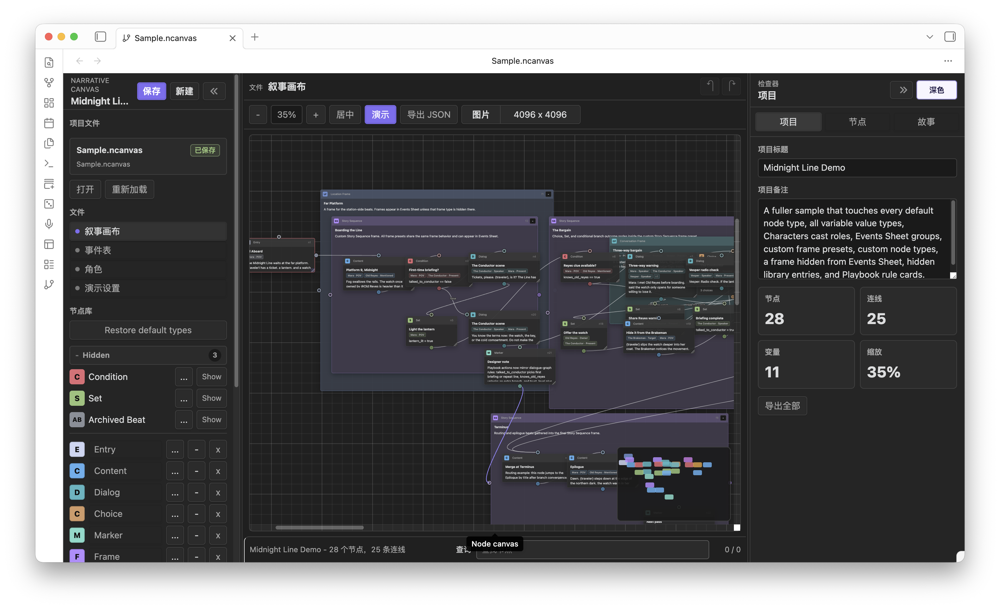
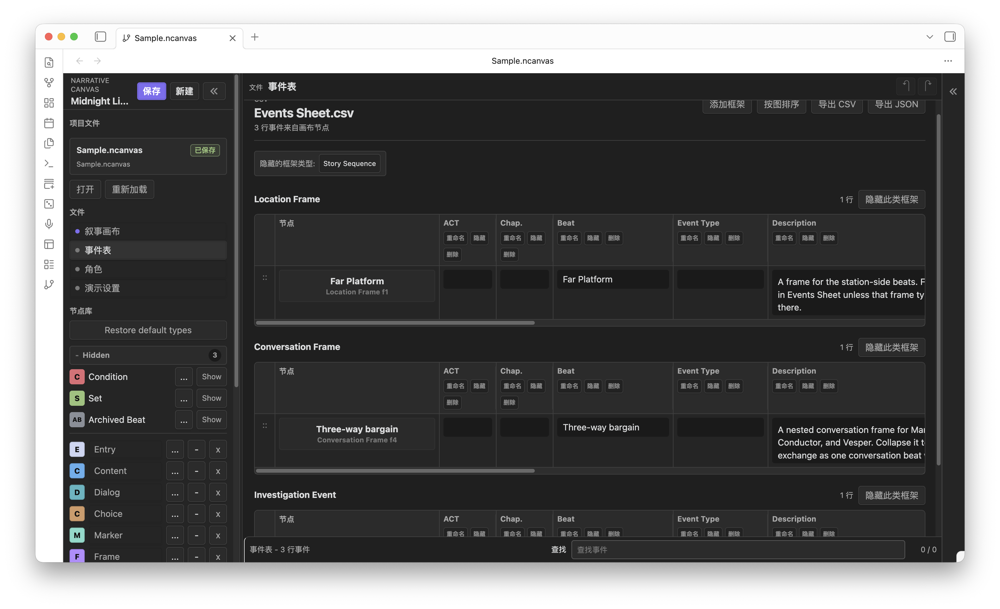
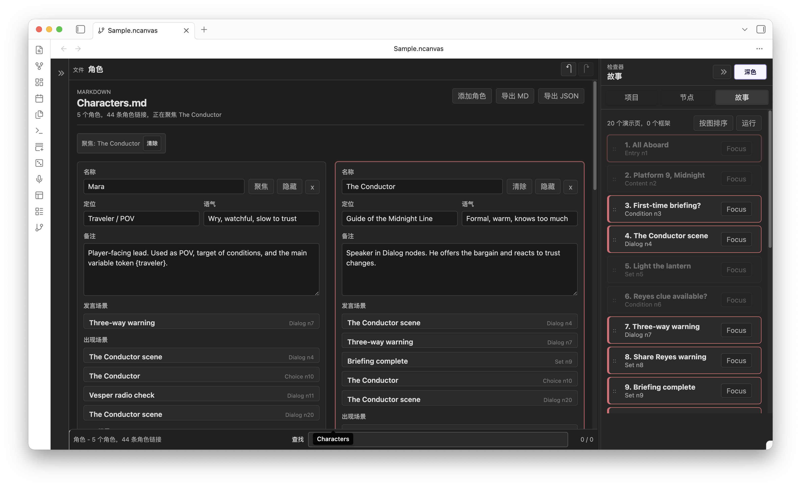
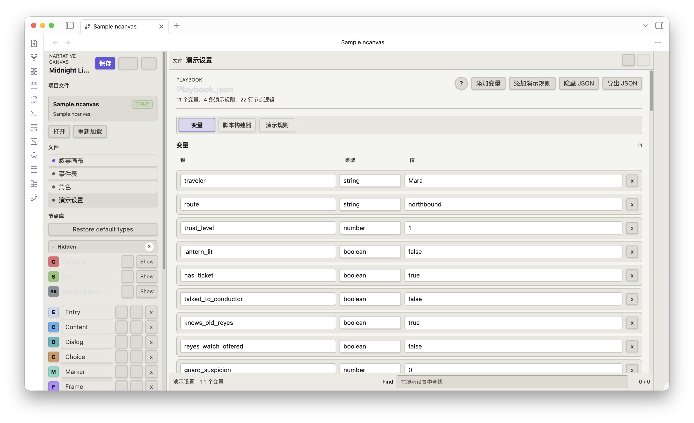
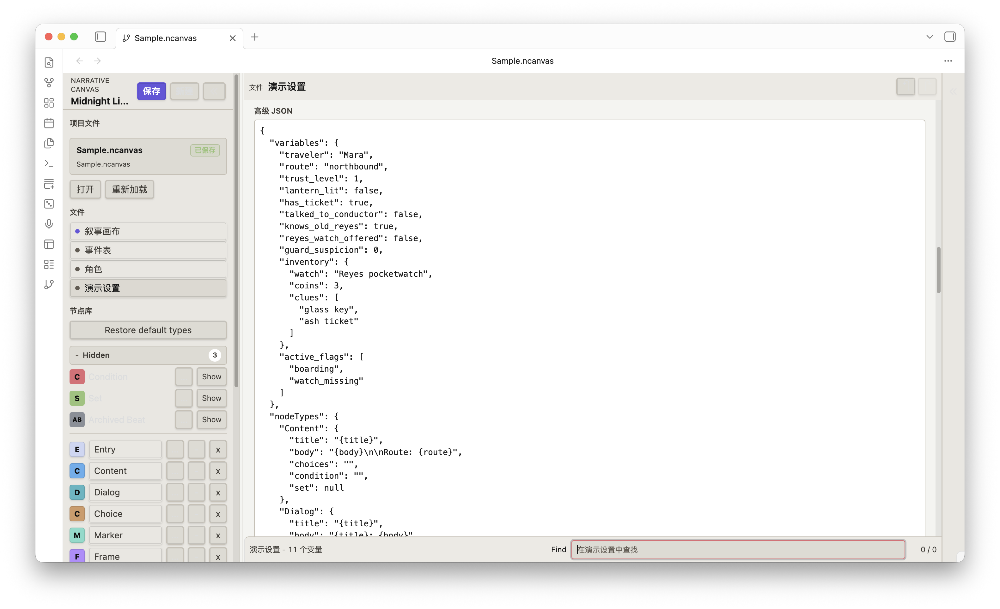

# Narrative Canvas (中文)

English version: [README.md](README.md)

Changelog and release notes: [GitHub Releases](https://github.com/ringeringeraja33/NarrativeCanvas/releases)

## 简介

Narrative Canvas 是一个用于复杂叙事写作与设计的节点式工作区。它可以把剧情段落、角色对白、选择分支、条件判断、变量变化、路由、角色和笔记整理成可连接、可预览的互动流程。它适用于游戏、互动小说、分支剧本、任务链和其他非线性叙事结构。

更推荐把它用于整理思路、检查分支、准备展示和说明复杂叙事结构。正文、对白润色、剧本定稿仍建议放在你常用的写作工具里完成。

界面支持英文与中文。网页端右下角有一个 `EN / 中` 浮动切换按钮；Obsidian 插件设置里有 `语言` 选项，可以选择跟随 Obsidian 的界面语言。



### 安全提醒

- `Playbook.json` 是声明式配置。它可以控制 `演示` 的标题、正文、选项按钮、简单条件和变量写入；它不会执行任意 JavaScript。
- `隐藏` 只隐藏 `事件表` 的列，保留数据。`删除` 会从 schema 移除列，并清掉显示在 `事件表` 中的 `框架` 节点里对应字段的值。
- 删除节点后，相关内容会被放到运行路径之外的归档数据里，误删风险会低一些。重要项目仍建议保留版本。
- 网页端 `保存` 存到浏览器本地缓存。Obsidian 端 `保存` 写入当前库里的 `.ncanvas` 项目文件。
- `保存`：保存当前项目。网页端写入浏览器 `localStorage`；Obsidian 端写入当前库里的 `.ncanvas` 项目文件。
- `新建`：新建空项目。网页端使用浏览器存储；Obsidian 端会按插件设置里的文件名模板创建新的 `.ncanvas` 文件。
- `打开`：网页端从本地磁盘选择并导入项目文件；Obsidian 端从库里选择项目文件打开。
- `重新加载`：放弃未保存修改，重新加载当前保存来源。网页端读取浏览器存储；Obsidian 端重新读取当前 `.ncanvas` 文件。
- `清除存储`：仅网页端可用。删除浏览器保存的项目，并加载一个空项目。

### 网页

可以直接打开 `index.html`，也可以访问：

<https://ringeringeraja33.github.io/NarrativeCanvas/>

`项目文件` 显示 `浏览器存储` 时，网页端读写的是 `localStorage`，不是浏览器的普通缓存。清 cache 不一定会清掉上次保存的项目。需要清空网页端保存内容时，用 `项目文件` 里的 `清除存储`。

右下角的 `EN / 中` 按钮可以切换界面语言。网页端会把选择记入 `localStorage`，第一次打开时根据文档与浏览器语言自动选择。

### Obsidian 插件

手动安装时，把最新发布的插件文件复制到：

```text
.obsidian/plugins/narrative-canvas/
```

然后重新加载 Obsidian，在 Community plugins 里启用 `Narrative Canvas`。

插件设置项：
- `语言` 可以在 `跟随 Obsidian`、`中文`、`English` 之间选择。
- `示例项目` 打开内置示例。
- `项目保存文件夹` 与 `新项目文件名` 控制新建 `.ncanvas` 文件的位置与命名。
- `自动保存间隔`（单位秒）控制 Narrative Canvas 写入当前项目文件的频率，留空表示沿用 Obsidian 的自动保存间隔。
- `上次编辑的项目` 显示并允许清除 ribbon 按钮下一次会打开的项目路径。

### 基本流程

1. 打开 `Narrative.canvas`。
2. 从 `节点库` 添加节点。
3. 从一个节点的输出端口连到另一个节点的输入端口。
4. 用 `框架` 归组节点。`框架` 默认进入 `事件表`；如果某种 `框架` 只是画布上的归组辅助，可以在类型设置里隐藏。
5. 选中节点，在右侧 `检查器` 编辑。
6. 在 `故事` 里查看从 Entry 可到达的故事顺序。
7. 点击 `演示` 预览当前叙事路线。
8. 结构整理好后保存或导出。工具栏的 PNG 分辨率按输出像素分档（`4096 x 4096`、`6144 x 6144`、`8192 x 8192`、`12000 x 12000`），导出文件名记录实际像素尺寸；超大画布会自动缩放以避开浏览器对位图大小的限制。

### 默认节点类型

- **Entry**：`演示` 的起点。
- **Content**：叙述或场景文字。
- **Dialog**：可以是一句台词，也可以是一组多轮对话。每一轮都有自由填写的 `speaker` 和 `line`；`speaker` 如果匹配 `角色`，会自动补 `Speaker` cast。
- **Choice**：每个 `选项` 在 `演示` 里显示为一个按钮。每个 `选项` 可以单独设置 `条件要求` 和选择后 `效果`，并且用稳定的 `选项` ID 绑定连线，重排时不会错连。
- **Condition**：旧项目兼容用的流程节点。新项目通常应使用节点 `条件要求` 或 Choice `选项` 的 `条件要求`。Condition 节点会输出两条带标签的连线 `true` 与 `false`，`演示` 会按条件结果走第一条或第二条；右键连线菜单也会显示哪条线对应哪个分支。支持复合表达式，例如 `trust_level >= 2 && lantern_lit == true`，运算符可用 `==`、`!=`、`>=`、`<=`、`>`、`<`，并用 `&&` 或 `||` 拼接。
- **Set**：旧项目兼容用的流程节点。新项目通常应使用节点 `效果` 或 Choice `选项` 的 `效果`。
- **Marker**：规划备注。
- **Frame**：可折叠框式归组节点，并且可以在 `事件表` 里生成一行。Location Frame、Conversation Frame 这类预设都是带有自定义字段和 `事件表` 可见性设置的普通 `框架`。

默认节点类型模板可以重命名、隐藏、删除、恢复、改颜色，也可以调整字段。Entry 是系统类型，不能删除；Set 和 Condition 默认作为遗留（legacy）类型隐藏。

非 `框架` 节点的 `检查器` 里还有 **`状态逻辑`**。`条件要求` 用来判断 `演示` 中这个节点能否通过，`效果` 可以在访问或选择节点时对变量执行 `set`、`add`、`append`、`toggle`、`clear`，`路线` 可以继续按连线走、结束路线，或跳到手动输入的节点标题。旧项目里的 Jump 节点仍会加载，但 Jump 不再是默认节点类型。

### 白板画布操作

- 拖动节点头部可以移动节点。
- 拖动 `框架` 头部时，当前在 `框架` 内的节点会一起移动。
- 可以用 Shift/Cmd/Ctrl 点击或矩形框选多选节点和 `框架`；多选后拖动任一已选对象的头部，会移动整个选择集。
- 点击输出端口，再点击输入端口，可以建立连线。
- 连线过程中双击空白画布，可以取消待建立的连线。
- 右键点击已有的连线，可以选择重连或删除。
- 可以在 Canvas 或 `故事` 中折叠 `框架`。两处共享同一个折叠状态。Canvas 中 `框架` 折叠时，连到内部节点的线会临时显示为从 `框架` 的端口进出，但不会改写真实连线。
- `框架` 与 `事件框架` 默认在普通节点的下层显示，新建 `框架` 会放在已有默认顺序 `框架` 的最上方，避免一次性把旧的归组 `框架` 盖住。需要时仍可以从右键菜单的层级控件手动调整。
- 每个节点都有两个端口：**输入端口**（input）只接收连线的 *终点*，箭头指向它；**输出端口**（output）只发出连线的 *起点*。连线方向永远是 **输出 → 输入**，两端不能互换；先点输入端口再点输出端口不会建立连线。
- 端点滑动重排：把端口拖动可以沿当前节点边缘滑动。

### 故事

`故事` 显示从 Entry 节点可到达的结构。非 `框架` 节点只有从 Entry 可到达时才显示。`框架` 节点本身可到达，或者包含了需要显示的子节点时，会显示在 `故事` 里。

`故事` 里的包含关系存为节点上的显式 `frameId`。旧项目会在打开时按几何位置推断一次：没有父 `框架` 的节点会归入包含其中心点的最小 `框架`；之后移动节点、`故事` 条目或 `框架` 时，会更新这个显式归属，而不是单靠重叠关系反复重算。

`故事` 的显示读取当前 canvas 的连线和 `框架` 归属；`故事` 里的操作会反写到 canvas。把 `故事` 条目拖进 `框架`，会把该节点移动到 `框架` 内并写入 `frameId`；如果拖动的是 `框架`，也会带着它在 `故事` 里的后代一起移动。必要时，目标 `框架` 会扩展以包住被拖入的内容。把条目拖到根层级，会清掉 `frameId` 并把节点移到 `框架` 外。

`框架` 的折叠状态在 `故事` 和 Canvas 之间共享。折叠后两处都会隐藏子节点；展开后，子条目和原本节点到节点的连线显示会恢复。

手动拖动产生的 `故事` 顺序会写入 `storyOrder`。`按图排序` 会清掉这些手动顺序，回到当前连线顺序。

`故事` 里的 `聚焦` 会选中节点，打开节点 `检查器`，把节点以 100% 缩放居中到 canvas。

### 事件表



`框架` 节点默认进入 `事件表`。不同 `框架` 类型会分成不同表格。如果某种 `框架` 只用于画布归组，可以在节点类型编辑器中启用 `Hide frame rows from Events Sheet`。

列可以重命名、隐藏或删除。隐藏的列会集中显示在每张表最右侧的 `隐藏` 列里，方便恢复。删除 schema 字段时，会从 `框架` 类型定义里移除该字段，并清掉已有 `框架` 节点上的对应值。

`按图排序` 会清掉手动行顺序，按当前 canvas 连线关系重新排序。

### 角色



`角色` 可以通过 Cast chips 关联到节点：

- `POV`
- `Speaker`
- `Present`
- `Mentioned`
- `Target`
- `Owner`

也可以在节点正文里输入 `@角色名` 创建自然引用。`角色` 页面会按 `故事` 顺序列出角色相关节点，包括说话场景、在场场景、被提到的位置、拥有关系和 `事件框架`。

`角色聚焦` 会高亮相关节点。

### 演示设置




可以这样理解 `Playbook.json`：

**`节点库` 决定节点有哪些字段，节点 `检查器` 填这些字段，`演示设置` 决定 `演示` 预览时怎么读取这些字段。**

它不是正文编辑器，也不是 JavaScript 运行器。它是一张给 `演示` 预览使用的规则表。

`演示设置` 页面分为三个标签：

- **`变量`** 列出项目里所有变量及其类型与当前值。新建变量会自动聚焦。
- **`脚本构建器`** 集中编辑每个非 `框架` 节点的 `条件要求`、`效果`、`路线`；这里改的是节点 `检查器` 里 `状态逻辑` 那段的同一份逻辑。
- **`演示规则`** 只保留演示播放器设置：Start Node、Choice Display、End Condition、Visit Tracking、Debug Mode。

点 `高级 JSON` 可以打开底层 `Playbook.json` 编辑器进行精确编辑。JSON 结构为 `{ "variables": { ... }, "nodeTypes": { ... }, "actions": [ ... ] }`。`actions` 数组保存的是 `演示` 运行时会自动应用的声明式状态变化：

- `trigger`（`时机`）：`onVisit`（`进入时`）、`onChoose`（`选择时`）、`gate`（`条件门`）、`manual`（`手动`）之一。
- `op`（`动作`）：`set`（`设置`）、`add`（`添加`）、`subtract`（`减去`）、`append`（`追加`）、`remove`（`移除`）、`toggle`（`切换`）、`clear`（`清除`）、`if`（`如果`）、`goTo`（`跳转到`）、`show`（`显示`）、`hide`（`隐藏`）、`lockChoice`（`锁定选项`）、`unlockChoice`（`解锁选项`）之一。
- `category`（`分类`）：`Quest`（`任务`）、`Quest Entry`（`任务条目`）、`Variable`（`变量`）、`Actor`（`角色`）、`Item`（`物品`）、`Location`（`地点`）、`Sim Status`（`模拟状态`）、`Alert`（`提示`）、`Misc`（`杂项`）、`Custom`（`自定义`）、`Manual Enter`（`手动输入`）之一。非 `变量` 类的状态会存到 `category.key` 命名空间下（例如 `actor.Mara.trust`）。
- `target`（`应用到`）：可以填节点 id、类型、类型显示名或标题。留空表示对所有节点生效。
- `key`（`键`）：状态槽位；`value`（`值`）：字面量或 `{token}` 模板。
- `gate` + `op: "if"` 可以让 `演示设置` 从外部决定一个 Condition 节点的分支。

#### 一个示例

你想做一个选择：交出怀表后信任变高，否则走另一条路。

`Playbook.json`：

```json
{
  "variables": {
    "trust_level": 1,
    "watch": "Reyes's pocketwatch",
    "lantern_lit": false
  },
  "playRules": {
    "startNode": { "enabled": true, "value": "Start" },
    "choiceDisplay": { "enabled": true, "value": "hideUnavailable" },
    "debugMode": { "enabled": false, "value": false }
  },
  "actions": [
    { "id": "a0", "trigger": "gate", "target": "Enough trust and lantern?", "op": "if", "category": "Variable", "key": "trust_level", "value": ">= 2 && lantern_lit == true" },
    { "id": "a1", "trigger": "onVisit", "target": "Offer the watch", "op": "set", "category": "Variable", "key": "watch_owner", "value": "Reyes" },
    { "id": "a2", "trigger": "onChoose", "target": "The Conductor", "op": "add", "category": "Actor", "key": "Mara.trust", "value": "1" }
  ]
}
```

节点填写：

Choice `选项`：

```json
{
  "label": "Hand over {watch}",
  "requires": "trust_level >= 1",
  "effects": [
    { "op": "set", "key": "watch_owner", "value": "Reyes" },
    { "op": "add", "key": "trust_level", "value": "1" }
  ]
}
```

节点 `条件要求`：

```text
trust_level >= 2 && lantern_lit == true
```

结果：`演示` 里按钮能显示变量，不可用 `选项` 可以隐藏或灰显，`选项` 的 `效果` 只在玩家选择该 `选项` 后改变变量；节点 `条件要求` 或对应的 `演示设置` `gate` 动作可以控制后续路线。
