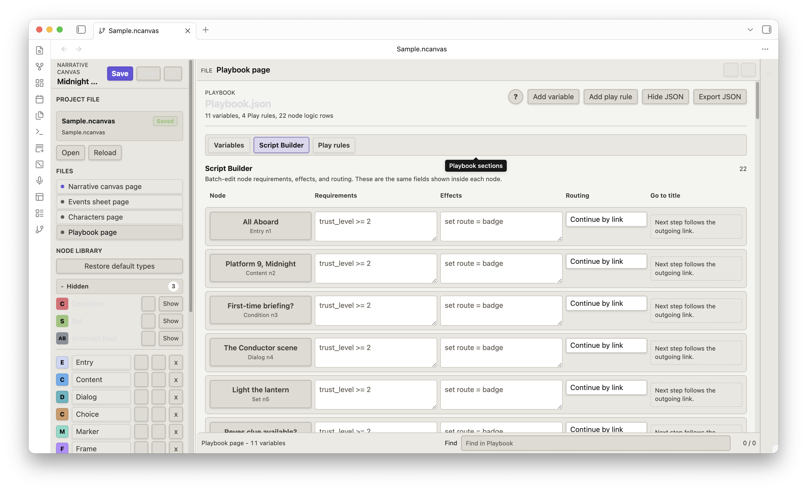
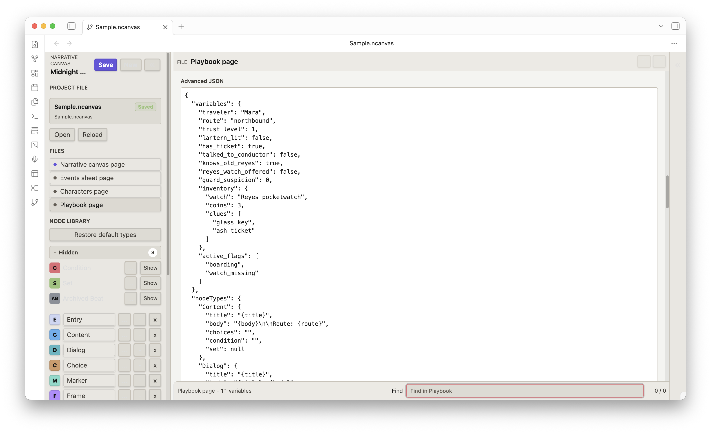

# Narrative Canvas

Changelog and release notes: [GitHub Releases](https://github.com/ringeringeraja33/NarrativeCanvas/releases)

中文版：[README-zh.md](https://github.com/ringeringeraja33/NarrativeCanvas/blob/main/README-zh.md)

<video src="https://github.com/ringeringeraja33/NarrativeCanvas/raw/main/assets/videos/runtime.mov" controls width="800" muted></video>

## English

Narrative Canvas is a node-based workspace for writing and designing complex stories. It can organize story beats, character dialog, choice branches, conditions, variables, routing, characters, and notes into a connected, previewable interactive flow. It is suitable for games, interactive fiction, branching scripts, questlines, and other nonlinear narrative structures.

It is best used for organizing ideas, checking branching logic, preparing pitches, and demonstrating how a story or questline works. It is not meant to replace prose drafting tools. Write the actual manuscript, script, or dialogue polish in your usual editor; use Narrative Canvas to keep the structure understandable.

The interface is available in English and 中文. The web app shows a floating `EN / 中` toggle in the lower-right corner; the Obsidian plugin exposes a `Language` setting that can follow the Obsidian interface language automatically.


### Safety Notes

- `Playbook.json` is declarative. It can format Play output, define choice buttons, read simple conditions, and write variables. It does not run arbitrary JavaScript.
- Hide keeps Events Sheet data. Delete removes a column from the schema and clears matching values from frame nodes shown in Events Sheet.
- Deleted nodes are archived outside the runtime path so accidental deletion is less destructive, but you should still save versions of important work.
- Browser Save writes to browser local storage. Obsidian Save writes the current `.ncanvas` project file in your vault.
- `Save`: saves the current project. In the web app, it writes to browser `localStorage`. In Obsidian, it writes the current `.ncanvas` project file in your vault.
- `New`: creates a blank project. In the web app, the new project uses browser storage. In Obsidian, it creates a new `.ncanvas` file from the plugin filename settings when possible.
- `Open`: in the web app, imports a project file from disk. In Obsidian, opens a project file from your vault.
- `Reload`: discards unsaved changes and reloads the current saved source. In the web app, it reads browser storage. In Obsidian, it rereads the current `.ncanvas` file.
- `Clear storage`: web app only. It deletes the browser-saved project and loads a blank project.

### Web App

Open `index.html` directly or use:

<https://ringeringeraja33.github.io/NarrativeCanvas/>

When the project file card says `Browser storage`, the web app is reading and writing `localStorage`, not the browser HTTP cache. Clearing cached files may leave the saved project intact. Use `Clear storage` in the Project File controls to delete the browser-saved project and load a blank one.

The lower-right floating `EN / 中` button switches the interface language. The web app remembers the last choice in `localStorage`; the first load picks a language from the document and browser locale.

### Obsidian Plugin

For manual installation, copy the latest released plugin files into:

```text
.obsidian/plugins/narrative-canvas/
```

Then reload Obsidian and enable `Narrative Canvas` in Community plugins.

Plugin settings: 
- `Language` chooses between `Follow Obsidian`, `中文`, and `English`. 
- `Sample project` opens the bundled sample. 
- `Project save folder` and `New project file name` control where new `.ncanvas` files are written. 
- `Auto-save interval` (in seconds) controls how often Narrative Canvas writes to the active project file; leave it empty to inherit Obsidian's autosave cadence. 
- `Current project` shows and clears the path that the ribbon button will open next.

### Main Workflow

1. Open `Narrative.canvas`.
2. Add nodes from the Node Library.
3. Connect an output port to an input port.
4. Use frames to group related nodes. Frames appear in Events Sheet by default; a frame type can be hidden from the sheet when it is only a canvas grouping aid.
5. Select a node and edit it in the Inspector.
6. Use Story to inspect the reachable flow from Entry.
7. Click Play to run the current narrative route.
8. Save or export when the structure is ready to share. The PNG resolution selector in the toolbar is sized by output pixels (`4096 x 4096`, `6144 x 6144`, `8192 x 8192`, `12000 x 12000`); the exported file name records the actual rendered pixel size, and large canvases are scaled down automatically to stay inside browser raster limits.

### Default Node Types

- **Entry** starts the playable path.
- **Content** holds narration or scene text.
- **Dialog** can hold one line or multiple turns. Each turn has a free-text speaker and line; speakers can match Characters and auto-fill Speaker cast chips.
- **Choice** shows one Play button per option. Each option can have Requirements and on-choose Effects, with stable option IDs so links survive option reordering.
- **Condition** is a legacy flow node for old projects. New gates should usually use node Requirements or Choice option Requirements. Condition nodes emit two ordered outgoing links labelled `true` and `false`; the runtime walks the first link when the condition passes and the second when it fails, and the right-click branch menu names the slots explicitly. Compound expressions such as `trust_level >= 2 && lantern_lit == true` are supported (operators: `==`, `!=`, `>=`, `<=`, `>`, `<`, joined by `&&` or `||`).
- **Set** is a legacy flow node for old projects. New state changes should usually use node Effects or Choice option Effects.
- **Marker** is a planning note.
- **Frame** groups nodes and can become a row in Events Sheet. Frame presets such as Location Frame or Conversation Frame are ordinary frames with custom fields and an Events Sheet visibility setting.

Default node types are editable templates. Entry is a system type and cannot be deleted; other types can be renamed, hidden, deleted, restored, recolored, and given fields. Set and Condition are hidden as legacy types by default.

Non-frame nodes also have **State Logic** in the Inspector. Requirements gate whether the node can pass in Play, Effects can set, add, append, toggle, or clear variables when the node is visited or chosen, and Routing can continue by link, end the route, or go to a node title. Existing projects that contain Jump nodes still load, but Jump is no longer a default node type.

### Canvas Operations

- Drag nodes by their header.
- Drag a frame by its header to move the nodes currently inside it.
- Use Shift/Cmd/Ctrl click or rectangle select to select multiple nodes and frames, then drag any selected header to move the group.
- Click an output port, then an input port, to connect nodes.
- Double-click blank canvas to cancel a pending connection.
- Right-click a link to reconnect or delete it.
- Collapse a frame from Canvas or Story. The same collapsed state is shared by both views. When a frame is collapsed on Canvas, links to nodes inside it are drawn through the frame ports without changing the saved links.
- Frames and event frames default to a layer below regular nodes, and a new frame is placed above existing default-order frames so it doesn't bury older grouping frames. The layer can still be adjusted from the node context menu.

#### Connection Ports

Every node carries two ports painted in the node's own color:

- **Input port** accepts the *end* of a link. The arrowhead points into it.
- **Output port** emits the *start* of a link.

Default placement differs by node kind:

- Regular nodes (Content / Dialog / Choice / Marker / etc.) — input on the **top** edge, output on the **bottom** edge.
- Frame nodes (visual or Events Sheet) — input on the **left** edge, output on the **right** edge.

Links always flow output → input. The two ports cannot be swapped; clicking an input first and then an output is rejected. The active output port pulses while a connection is pending so you can see which node you started from. Connection rules:

- Click an output port, then an input port on a different node, to create a link.
- Double-click blank canvas, press `Esc`, or click the pulsing output again to cancel a pending connection.
- Right-click a link to reconnect either end, swap to a different choice branch, or delete the link.

**Sliding along the edge:** drag a port to relocate it. It can slide along its current edge or jump to a different edge of the same node, so you can move the input from `top` to `left` if a particular layout reads better that way. The link recalculates its path live. This helps when a node has multiple incoming or outgoing lines that would otherwise overlap. The port position is persisted with the node so complex routes stay readable across sessions.

### Story

Story shows the reachable structure from the Entry node. Non-frame nodes appear when they are reachable from Entry. Frame nodes appear when the frame is reachable itself, or when it contains an included child node.

Story containment is stored as explicit `frameId` membership on each node. Older projects are inferred once from canvas geometry by assigning each unparented node to the smallest frame that contains its center point; after that, moving nodes, Story rows, or frames updates the explicit membership instead of recalculating containment from overlap alone.

Story display is read from the current canvas graph and frame membership. Story operations write back to the canvas. Dragging a Story row into a frame moves that node into the frame area and assigns its `frameId`; when the dragged row is a frame, its Story descendants move with it. The target frame can expand to contain the moved content. Dragging a row to the root level clears `frameId` and moves the node outside frames.

Frame collapse is shared between Story and Canvas. Collapsing a frame hides its children in both places; expanding it restores the child rows and the original node-to-node link display.

Manual Story row ordering is stored as `storyOrder`. `Re-sort by graph` clears those manual order values and returns Story ordering to the current graph order.

Story `Focus` selects the node, opens the Node inspector, centers it on canvas, and uses 100% zoom.

### Events Sheet


Frame nodes appear in Events Sheet by default. Different frame types are grouped into separate tables. In the node type editor, enable `Hide frame rows from Events Sheet` for frame types that should stay purely organizational on the canvas.

You can rename, hide, or delete columns. Hidden columns appear in the rightmost `Hidden` column of each table so they can be restored. Deleted schema fields are removed from frame type definitions and matching values are cleared from existing frame nodes.

`Re-sort by graph` clears manual row ordering and sorts event rows by the current canvas graph.

### Characters


Characters can be linked to nodes with Cast chips:

- `POV`
- `Speaker`
- `Present`
- `Mentioned`
- `Target`
- `Owner`

You can also type `@Character Name` inside node text to create a natural reference. Character pages list backlinks by story order, including speaker scenes, present scenes, mentions, owned nodes, and frames.

Use Character focus to highlight related nodes.

### Playbook




Think of `Playbook.json` this way:

**Node Library decides which fields a node type has. Node Inspector fills those fields. Playbook decides how Play reads those fields.**

It is not a prose editor or a JavaScript runner. It is a rule table for Play preview.

The Playbook page has three tabs:

- **Variables** lists every project variable and its current type and value. New variables are focused automatically.
- **Script Builder** is a batch editor for each non-frame node's Requirements, Effects, and Routing; it edits the same logic shown in the node Inspector State Logic section.
- **Play rules** is limited to demo runner settings: Start Node, Choice Display, End Condition, Visit Tracking, and Debug Mode.

Use `Advanced JSON` to open the underlying `Playbook.json` editor for exact edits. The JSON structure is `{ "variables": { ... }, "nodeTypes": { ... }, "actions": [ ... ] }`. The `actions` array records declarative state changes the runtime applies during Play:

- `trigger` is one of `onVisit`, `onChoose`, `gate`, or `manual`.
- `op` is one of `set`, `add`, `subtract`, `append`, `remove`, `toggle`, `clear`, `if`, `goTo`, `show`, `hide`, `lockChoice`, `unlockChoice`.
- `category` is one of `Quest`, `Quest Entry`, `Variable`, `Actor`, `Item`, `Location`, `Sim Status`, `Alert`, `Misc`, `Custom`, `Manual Enter`. Non-variable categories are stored under `category.key` (for example `actor.Mara.trust`).
- `target` matches a node by id, type, type label, or title. Blank means any node.
- `key` is the state slot; `value` is the literal or `{token}` template.
- `gate` + `op: "if"` lets the Playbook drive a Condition node's branch from outside the node itself.

#### An example

You want a choice: hand over the watch, raise trust, otherwise continue on another route.

Playbook:

```json
{
  "variables": {
    "trust_level": 1,
    "watch": "Reyes's pocketwatch",
    "lantern_lit": false
  },
  "playRules": {
    "startNode": { "enabled": true, "value": "Start" },
    "choiceDisplay": { "enabled": true, "value": "hideUnavailable" },
    "debugMode": { "enabled": false, "value": false }
  },
  "actions": [
    { "id": "a0", "trigger": "gate", "target": "Enough trust and lantern?", "op": "if", "category": "Variable", "key": "trust_level", "value": ">= 2 && lantern_lit == true" },
    { "id": "a1", "trigger": "onVisit", "target": "Offer the watch", "op": "set", "category": "Variable", "key": "watch_owner", "value": "Reyes" },
    { "id": "a2", "trigger": "onChoose", "target": "The Conductor", "op": "add", "category": "Actor", "key": "Mara.trust", "value": "1" }
  ]
}
```

Fill the nodes this way:

Choice option:

```json
{
  "label": "Hand over {watch}",
  "requires": "trust_level >= 1",
  "effects": [
    { "op": "set", "key": "watch_owner", "value": "Reyes" },
    { "op": "add", "key": "trust_level", "value": "1" }
  ]
}
```

Node Requirement:

```text
trust_level >= 2 && lantern_lit == true
```

Result: Play shows buttons with variable replacement, unavailable choices can be hidden or disabled, option Effects change variables only when that option is chosen, and node Requirements (or matching Playbook gate actions) can control the route.

