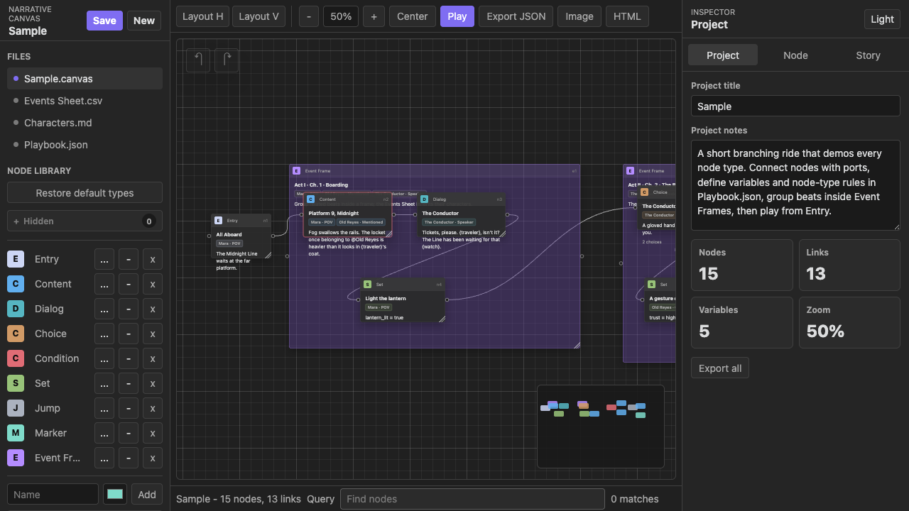
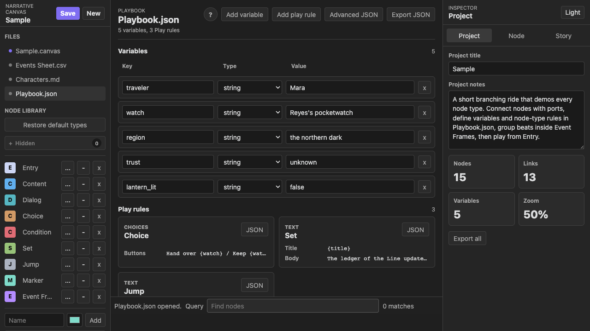
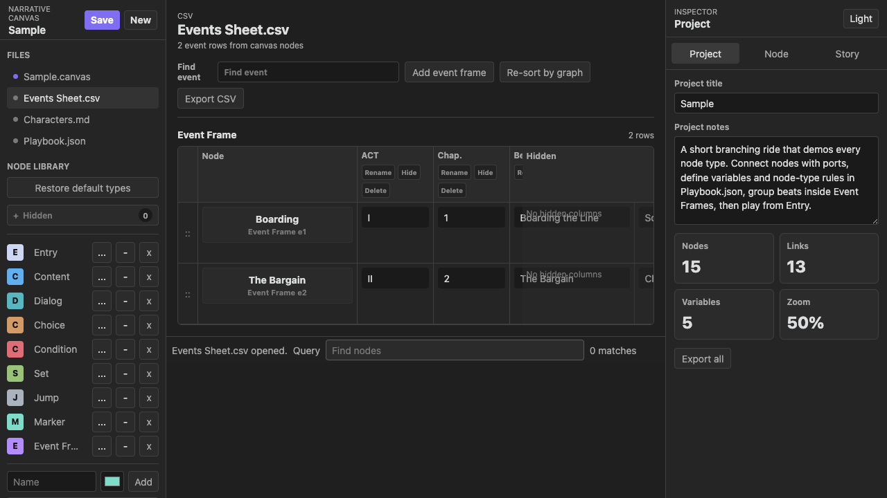
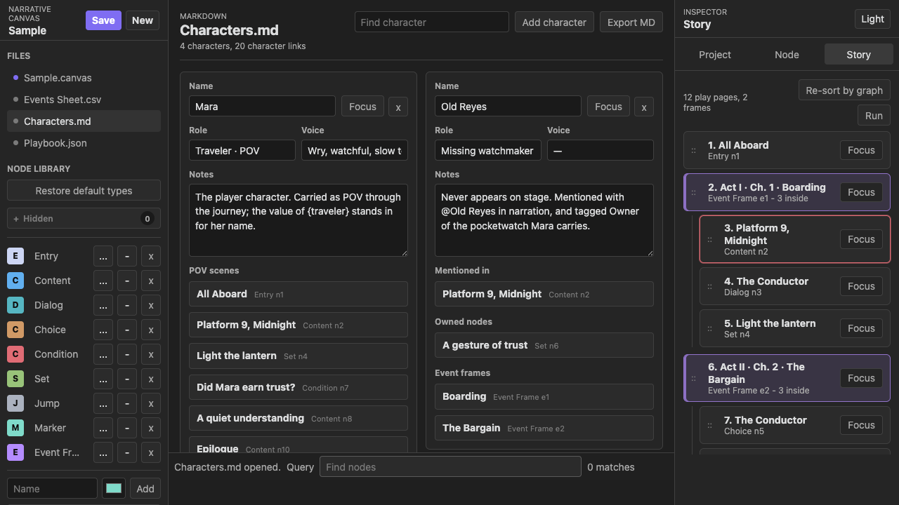

# Narrative Canvas

Narrative Canvas is a visual planning workspace for complex stories. It helps you break a narrative into scenes, choices, conditions, variables, event frames, and character references, then connect them into a playable flow.

It is best used for organizing ideas, checking branching logic, preparing pitches, and demonstrating how a story or questline works. It is not meant to replace prose drafting tools. Write the actual manuscript, script, or dialogue polish in your usual editor; use Narrative Canvas to keep the structure understandable.



## Use Cases

- Branching fiction, game quests, RPG scenes, VN routes, and interactive scripts.
- Story maps where you need to see conditions, choices, jumps, and state changes.
- Event sheets for production planning: act, chapter, beat, event type, description, and characters.
- Character indexing: see where a character speaks, appears, is mentioned, owns something, or belongs to an event frame.
- Demos: run the flow from the Entry node and show the story path without exposing draft notes.

## Safety Notes

- `Playbook.json` is declarative. It can format Play output, define choice buttons, read simple conditions, and write variables. It does not run arbitrary JavaScript.
- Hide keeps Events Sheet data. Delete removes a column from the schema and clears matching values from Event Frame nodes.
- Deleted nodes are archived outside the runtime path so accidental deletion is less destructive, but you should still save versions of important work.
- Browser Save writes to browser local storage. Obsidian Save writes the current `.ncanvas` project file in your vault.

## Web App

Open `index.html` directly or use:

<https://ringeringeraja33.github.io/NarrativeCanvas/>

The web app is useful for quick planning and demos. Use `Export JSON`, `Image`, `HTML`, `Characters.md`, `Events Sheet.csv`, or `Playbook.json` when you need portable files.

## Obsidian Plugin

For manual installation, copy the plugin files into:

```text
.obsidian/plugins/narrative-canvas/
```

Then reload Obsidian and enable `Narrative Canvas` in Community plugins.

The plugin stores projects as `.ncanvas` files. By default the file name follows the project title, such as:

```text
Sample.ncanvas
```

If you rename the project title and click Save, the vault file is renamed to match. The plugin settings currently expose only the vault-relative save folder.

## Main Workflow

1. Open `Sample.canvas`.
2. Add nodes from the Node Library.
3. Connect an output port to an input port.
4. Use frames to group related nodes. Use Event Frames when the group should appear in Events Sheet.
5. Select a node and edit it in the Inspector.
6. Use Story to inspect the reachable flow from Entry.
7. Click Play to run the current narrative route.
8. Save or export when the structure is ready to share.

Undo and Redo are floating buttons in the upper-left of the canvas. The minimap floats in the lower-right; click it to move the main canvas.

## Node Types

- **Entry** starts the playable path.
- **Content** holds narration or scene text.
- **Dialog** is a character line. A Dialog title matching a character name is treated as Speaker.
- **Choice** shows one Play button per choice line.
- **Condition** reads a variable condition such as `trust == high`.
- **Set** writes a variable value.
- **Jump** marks a route transition or named destination. It does not teleport on its own; connect it to the next node you want the graph to visit.
- **Marker** is a planning note.
- **Frame** groups nodes visually.
- **Event Frame** groups story beats and becomes a row in Events Sheet.

All default node types are editable templates. You can rename, hide, delete, restore, recolor, and change their fields.

## Playbook



`Playbook.json` controls variables and Play rules.

Variables can be inserted into text with braces:

```text
The {traveler} keeps the {watch}.
```

Play rules can:

- choose title/body templates for a node type or node id;
- turn a field into Play choices;
- write variables when a node is visited;
- use a field as a condition gate.

Use `Add variable` and `Add play rule` for starter entries, then open `Advanced JSON` for direct editing. When a rule is added, the JSON editor scrolls to the inserted rule line.

## Events Sheet



Only Event Frame nodes appear in Events Sheet. Different Event Frame types are grouped into separate tables.

You can rename, hide, or delete columns. Hidden columns appear in the sticky `Hidden` column at the right edge of each table so they can be restored. Deleted schema fields are removed from Event Frame type definitions and matching values are cleared from existing Event Frame nodes.

`Re-sort by graph` clears manual row ordering and sorts event rows by the current canvas graph.

## Characters



Characters can be linked to nodes with Cast chips:

- `POV`
- `Speaker`
- `Present`
- `Mentioned`
- `Target`
- `Owner`

You can also type `@Character Name` inside node text to create a natural reference. Character pages list backlinks by story order, including speaker scenes, present scenes, mentions, owned nodes, and event frames.

Use Character focus to highlight related nodes without drawing a web of lines across the canvas.

## Canvas Operations

- Drag nodes by their header.
- Resize nodes from the lower-right handle.
- Click an output port, then an input port, to connect nodes.
- Double-click blank canvas to cancel a pending connection.
- Right-click a link to reconnect or delete it.
- Use `Layout H` or `Layout V` for automatic layout.
- Drag Story rows to change story order or move nodes into and out of frames.
- Story `Focus` selects the node, opens the Node inspector, centers it on canvas, and uses 50% zoom.

## Release Files

An Obsidian release should include:

```text
manifest.json
main.js
styles.css
index.html
app.js
canvas.css
assets/
```

`manifest.json` and `versions.json` should match the release version.
